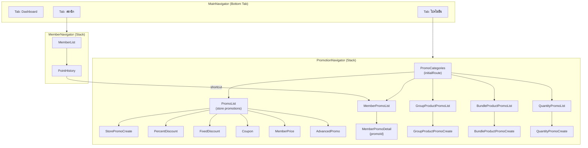
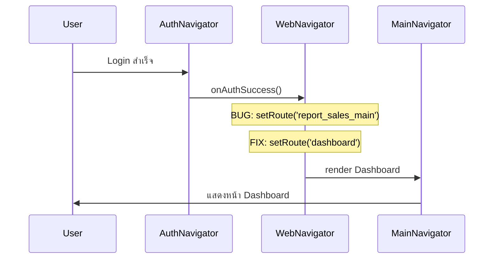

# Design — Member Promotion Menu Migration

## Overview

ปรับโครงสร้างเมนูโปรโมชั่นจาก flat list เป็นระบบ Category (5 หมวด) พร้อมย้ายโปรโมชั่นสมาชิก 12 ประเภทจากเมนู CRM มาอยู่ภายใต้เมนูโปรโมชั่น และแก้ไข post-login navigation ให้ไปที่ Dashboard แทน Reports

### Key Changes

1. **PromotionNavigator** — เปลี่ยน initialRoute จาก `PromoList` เป็น `PromoCategories` (หน้าเลือกหมวดหมู่)
2. **5 หมวดโปรโมชั่น** — ร้านค้า, สมาชิก, กลุ่มสินค้า, สินค้าร่วม, จำนวนสินค้า
3. **โปรโมชั่นสมาชิก** — ย้ายจาก Member_Navigator มาเป็น route ภายใต้ Promotion_Navigator
4. **Post-login fix** — แก้ WebNavigator onLogin handler ให้ navigate ไป `dashboard` แทน `report_sales_main`
5. **Promotion Forms** — สร้างฟอร์มสำหรับ Store, Product Group, Bundle, Quantity ตามแบบ Zort POS

---

## Architecture



### Post-Login Navigation Fix



**Root Cause:** ใน `WebNavigator.tsx` บรรทัด `onLogin={() => setRoute('report_sales_main')}` ทำให้หลัง login บน web ไป Reports แทน Dashboard

**Fix:** เปลี่ยนเป็น `onLogin={() => setRoute('dashboard')}`

---

## Components and Interfaces

### New Screens

| Screen | File | Description |
|--------|------|-------------|
| PromoCategoriesScreen | `src/screens/promotion/PromoCategoriesScreen.tsx` | หน้าเลือกหมวดโปรโมชั่น 5 หมวด |
| StorePromoCreateScreen | `src/screens/promotion/StorePromoCreateScreen.tsx` | ฟอร์มสร้างโปรโมชั่นร้านค้า |
| MemberPromoListScreen | `src/screens/promotion/MemberPromoListScreen.tsx` | รายการโปรโมชั่นสมาชิก 12 ประเภท |
| GroupProductPromoListScreen | `src/screens/promotion/GroupProductPromoListScreen.tsx` | รายการโปรโมชั่นกลุ่มสินค้า |
| GroupProductPromoCreateScreen | `src/screens/promotion/GroupProductPromoCreateScreen.tsx` | ฟอร์มสร้างโปรโมชั่นกลุ่มสินค้า |
| BundleProductPromoListScreen | `src/screens/promotion/BundleProductPromoListScreen.tsx` | รายการโปรโมชั่นสินค้าร่วม |
| BundleProductPromoCreateScreen | `src/screens/promotion/BundleProductPromoCreateScreen.tsx` | ฟอร์มสร้างโปรโมชั่นสินค้าร่วม |
| QuantityPromoListScreen | `src/screens/promotion/QuantityPromoListScreen.tsx` | รายการโปรโมชั่นตามจำนวน |
| QuantityPromoCreateScreen | `src/screens/promotion/QuantityPromoCreateScreen.tsx` | ฟอร์มสร้างโปรโมชั่นตามจำนวน |

### Modified Files

| File | Changes |
|------|---------|
| `src/navigation/PromotionNavigator.tsx` | เพิ่ม routes ใหม่, เปลี่ยน initialRoute เป็น PromoCategories |
| `src/navigation/WebNavigator.tsx` | แก้ onLogin → `setRoute('dashboard')` |
| `src/screens/web/WebPromotionScreen.tsx` | เพิ่ม category view ที่ตรงกับ mobile |
| `src/screens/member/PointHistoryScreen.tsx` | เพิ่ม read-only member promo section + shortcut button |

### PromotionNavigator Route Types

```typescript
// src/navigation/PromotionNavigator.tsx
export type PromoStackParamList = {
  // Category Selector (NEW - initialRoute)
  PromoCategories: undefined;
  
  // Store Promotions
  PromoList: undefined;              // existing - store promo list
  StorePromoCreate: undefined;       // NEW
  PercentDiscount: undefined;        // existing
  FixedDiscount: undefined;          // existing
  Coupon: undefined;                 // existing
  MemberPrice: undefined;            // existing
  AdvancedPromo: undefined;          // existing
  
  // Member Promotions
  MemberPromoList: undefined;        // NEW
  MemberPromoDetail: { promoId: string };  // NEW
  
  // Product Group Promotions
  GroupProductPromoList: undefined;   // NEW
  GroupProductPromoCreate: undefined; // NEW
  
  // Bundle Promotions
  BundleProductPromoList: undefined;  // NEW
  BundleProductPromoCreate: undefined; // NEW
  
  // Quantity Promotions
  QuantityPromoList: undefined;      // NEW
  QuantityPromoCreate: undefined;    // NEW
};
```

### PromoCategoriesScreen Interface

```typescript
interface PromoCategory {
  id: string;
  key: 'store' | 'member' | 'group' | 'bundle' | 'quantity';
  label: string;           // Thai name
  icon: string;            // Ionicons name
  route: string;           // navigation target
  activeCount: number;     // จำนวน promo ที่ active
}

const PROMO_CATEGORIES: Omit<PromoCategory, 'activeCount'>[] = [
  { id: '1', key: 'store',    label: 'ร้านค้า',      icon: 'storefront-outline',   route: 'PromoList' },
  { id: '2', key: 'member',   label: 'สมาชิก',       icon: 'people-outline',       route: 'MemberPromoList' },
  { id: '3', key: 'group',    label: 'กลุ่มสินค้า',   icon: 'albums-outline',       route: 'GroupProductPromoList' },
  { id: '4', key: 'bundle',   label: 'สินค้าร่วม',   icon: 'layers-outline',       route: 'BundleProductPromoList' },
  { id: '5', key: 'quantity', label: 'จำนวนสินค้า',  icon: 'calculator-outline',   route: 'QuantityPromoList' },
];
```

### Validation Functions Interface

```typescript
// src/utils/promoValidation.ts

interface ValidationResult {
  valid: boolean;
  errors: ValidationError[];
}

interface ValidationError {
  field: string;
  message: string;
}

// Product Group form validation
function validateProductGroupForm(form: ProductGroupFormData): ValidationResult;

// Bundle form validation
function validateBundleForm(form: BundleFormData): ValidationResult;

// Quantity form validation
function validateQuantityForm(form: QuantityFormData): ValidationResult;

// Store form validation
function validateStorePromoForm(form: StorePromoFormData): ValidationResult;

// Discount value validation
function validateDiscountValue(
  type: 'set_price' | 'fixed_amount' | 'percent',
  value: number
): ValidationResult;

// Tier overlap detection
function detectTierOverlaps(tiers: QuantityTier[]): OverlapResult[];

// Discount preview calculation
function calculateTierPreview(
  tiers: QuantityTier[],
  basePrice: number
): TierPreviewResult[];
```

---

## Data Models

### Product Group Promotion

```typescript
// src/types/productGroupPromo.ts
export interface ProductGroupPromotion {
  id: string;
  name: string;
  startDate: string;           // ISO date
  endDate?: string;            // undefined = ไม่กำหนดวันสิ้นสุด
  noEndDate: boolean;
  branchId: string;
  description?: string;
  products: ProductGroupItem[];  // min 2, max 200
  minBillTotal: number;        // 0 = ไม่มีขั้นต่ำ, max 999,999.99
  discountType: 'set_price' | 'fixed_amount' | 'percent' | 'free_product';
  discountValue: number;       // ค่าตามประเภท
  freeProducts: FreeProductItem[];  // 1-10 items (เมื่อ discountType = 'free_product')
  status: 'draft' | 'active' | 'expired' | 'disabled';
  createdAt: string;
  createdBy: string;
  shopId: string;
}

export interface ProductGroupItem {
  productId: string;
  productCode: string;
  productName: string;
  quantity: number;            // 1-999
  unitPrice: number;
}

export interface FreeProductItem {
  productId: string;
  productCode: string;
  productName: string;
  quantity: number;            // 1-999
  unitPrice: number;
}
```

### Bundle Promotion

```typescript
// src/types/bundlePromo.ts
export interface BundlePromotion {
  id: string;
  name: string;
  startDate: string;
  endDate?: string;
  noEndDate: boolean;
  branchScope: 'all' | 'selected';
  branchIds?: string[];
  description?: string;
  products: BundleProductItem[];  // min 2, max 50
  minBillTotal: number;
  discountType: 'set_price' | 'fixed_amount' | 'percent' | 'free_product';
  discountValue: number;
  freeProducts: FreeProductItem[];  // 1-10 items
  status: 'draft' | 'active' | 'expired' | 'disabled';
  createdAt: string;
  createdBy: string;
  shopId: string;
}

export interface BundleProductItem {
  productId: string;
  productCode: string;
  productName: string;
  quantity: number;
  unitPrice: number;
}
```

### Quantity Promotion

```typescript
// src/types/quantityPromo.ts
export interface QuantityPromotion {
  id: string;
  name: string;
  startDate: string;
  endDate?: string;
  noEndDate: boolean;
  branchScope: 'all' | 'selected';
  branchIds?: string[];
  description?: string;
  products: QuantityProductItem[];  // min 1
  tiers: QuantityTier[];            // 1-10 tiers
  status: 'draft' | 'active' | 'expired' | 'disabled';
  createdAt: string;
  createdBy: string;
  shopId: string;
}

export interface QuantityProductItem {
  productId: string;
  productCode: string;
  productName: string;
  sellingPrice: number;
}

export interface QuantityTier {
  id: string;
  minQty: number;           // min 1
  maxQty: number;           // max 9,999
  discountPerUnit: number;  // เปอร์เซ็นต์ 0.01-99.99
}
```

### Store Promotion Form Data

```typescript
// src/types/storePromo.ts
export interface StorePromoFormData {
  name: string;              // required
  startDate: string;         // required
  endDate?: string;          // required unless noEndDate
  noEndDate: boolean;
  discountPercent: number;
  minPurchase: number;
  description?: string;
  branchId: string;
}
```

### Promo Management Store

```typescript
// src/store/promoManagementStore.ts
interface PromoManagementStore {
  productGroupPromos: ProductGroupPromotion[];
  bundlePromos: BundlePromotion[];
  quantityPromos: QuantityPromotion[];

  // Product Group CRUD
  createProductGroupPromo: (data: Omit<ProductGroupPromotion, 'id' | 'createdAt' | 'status'>) => ProductGroupPromotion;
  updateProductGroupPromo: (id: string, data: Partial<ProductGroupPromotion>) => void;
  disableProductGroupPromo: (id: string) => void;

  // Bundle CRUD
  createBundlePromo: (data: Omit<BundlePromotion, 'id' | 'createdAt' | 'status'>) => BundlePromotion;
  updateBundlePromo: (id: string, data: Partial<BundlePromotion>) => void;
  disableBundlePromo: (id: string) => void;

  // Quantity CRUD
  createQuantityPromo: (data: Omit<QuantityPromotion, 'id' | 'createdAt' | 'status'>) => QuantityPromotion;
  updateQuantityPromo: (id: string, data: Partial<QuantityPromotion>) => void;
  disableQuantityPromo: (id: string) => void;

  // Counts for category screen
  getActiveCountByCategory: () => {
    store: number;
    member: number;
    group: number;
    bundle: number;
    quantity: number;
  };
}
```

---

## Correctness Properties

*A property is a characteristic or behavior that should hold true across all valid executions of a system—essentially, a formal statement about what the system should do. Properties serve as the bridge between human-readable specifications and machine-verifiable correctness guarantees.*

### Property 1: Category filter shows only matching promotions

*For any* promotion category selection and any set of promotions, the filtered promotion list shall contain only promotions whose type belongs to the selected category's allowed types, and shall contain all such matching promotions.

**Validates: Requirements 1.2, 3.1, 3.5**

### Property 2: Active count matches actual active promotions

*For any* set of promotions with varying statuses across all categories, the active count displayed per category shall equal the number of promotions in that category with status `'active'`.

**Validates: Requirements 1.3**

### Property 3: Member promotions sorted by priority

*For any* list of member promotions, the displayed list shall be ordered by `priority` field in ascending order (lower priority number first).

**Validates: Requirements 2.1**

### Property 4: Product count validation enforces type-specific bounds

*For any* promotion form (Product Group: 2–200 products; Bundle: 2–50 products; Quantity: min 1 product), the validation function shall accept only product counts within the type-specific inclusive range and reject all others.

**Validates: Requirements 4.3, 5.3, 6.4**

### Property 5: Free product validation enforces 1–10 items with 1–999 quantity

*For any* promotion form (Product Group or Bundle) with discount type `'free_product'`, the validation function shall accept only 1–10 free product items where each item has a quantity between 1 and 999 inclusive.

**Validates: Requirements 4.4, 5.4**

### Property 6: Form completeness validation rejects incomplete forms

*For any* promotion form (Product Group, Bundle, or Quantity) where required fields are missing or invalid (name empty, startDate empty, endDate empty when noEndDate is false, discount type unselected, products below minimum), the validation function shall return `valid: false` with errors listing all invalid fields.

**Validates: Requirements 4.6, 5.5**

### Property 7: Discount value bounds validation

*For any* discount type and value, the validation function shall reject: percent outside 1–99, set_price ≤ 0, fixed_amount ≤ 0, and minBillTotal outside 0–999,999.99. It shall accept all values within these bounds.

**Validates: Requirements 5.6, 4.5**

### Property 8: Quantity tier overlap detection

*For any* list of quantity tiers, if any two tiers have overlapping ranges (tier A's minQty ≤ tier B's maxQty AND tier B's minQty ≤ tier A's maxQty), the overlap detection function shall identify all overlapping pairs. If no overlaps exist, it shall return an empty result.

**Validates: Requirements 6.3**

### Property 9: Quantity tier configuration validation

*For any* set of tiers (0–15), the validation function shall accept exactly 1–10 tiers where each tier has minQty ≥ 1, maxQty ≤ 9,999, minQty ≤ maxQty, and discountPerUnit between 0.01 and 99.99 inclusive.

**Validates: Requirements 6.2**

### Property 10: Discount preview calculation correctness

*For any* valid tier configuration and base price, the preview calculation for a sample quantity in tier N shall produce: `discountedPrice = basePrice * (1 - tier.discountPerUnit / 100)`, and the before-price shall equal the original base price.

**Validates: Requirements 6.5**

### Property 11: No-end-date checkbox clears endDate

*For any* promotion form where `noEndDate` is `true`, the saved promotion object shall have `endDate` as `undefined`, and validation shall not require an endDate value.

**Validates: Requirements 11.5**

---

## Error Handling

### Form Validation Errors

| Scenario | Error Display | Recovery |
|----------|--------------|----------|
| Required field empty | Inline error message ใต้ field + highlight border สีแดง | ผู้ใช้กรอกข้อมูล |
| Discount value out of bounds | Inline error "ค่าส่วนลดไม่ถูกต้อง" + แสดงช่วงที่ยอมรับ | ผู้ใช้แก้ไขค่า |
| Product count below minimum | Toast "กรุณาเลือกสินค้าอย่างน้อย X รายการ" | ผู้ใช้เลือกเพิ่ม |
| Tier overlap detected | Inline error ที่ tier row ที่ซ้อน + highlight สีแดง | ผู้ใช้แก้ไขช่วง |
| Data load failure | Full-screen error state + ปุ่ม "ลองใหม่" | ผู้ใช้กดลองใหม่ |
| Promotion not found (MemberPromoDetail) | Toast "ไม่พบข้อมูลโปรโมชั่น" + คงอยู่ที่ list | ผู้ใช้ refresh |

### Navigation Error Handling

- ถ้า navigate ไป route ที่ไม่ permission → redirect กลับ PromoCategories
- ถ้า MemberPromoDetail ได้ promoId ที่ไม่มีอยู่ → แสดง error + stay at MemberPromoList

### Store Operation Errors

- Create/Update failure → แสดง error toast, ไม่ navigate ออก, เก็บ form data ไว้
- Optimistic update → ถ้า sync fail ให้ rollback state

---

## Testing Strategy

### Unit Tests (Example-Based)

ทดสอบ specific scenarios:
- PromoCategoriesScreen renders 5 categories with correct Thai labels and icons
- Navigation: category tap → correct list screen
- WebNavigator post-login route is `'dashboard'`
- MainNavigator first tab is Dashboard
- Each form type renders all required fields
- Empty state displays when no promotions exist
- Back navigation from sub-screens returns to PromoCategories
- MemberNavigator retains all CRM screens

### Property-Based Tests (fast-check)

ใช้ [fast-check](https://github.com/dubzzz/fast-check) library สำหรับ property-based testing

**Configuration:**
- Minimum 100 iterations per property
- Tag format: `Feature: member-promotion-menu-migration, Property {N}: {description}`

**Properties to implement:**
1. Category filter correctness (Property 1)
2. Active count calculation (Property 2)
3. Member promo sort order (Property 3)
4. Product count validation bounds (Property 4)
5. Free product validation bounds (Property 5)
6. Form completeness validation (Property 6)
7. Discount value bounds (Property 7)
8. Tier overlap detection (Property 8)
9. Tier configuration validation (Property 9)
10. Discount preview calculation (Property 10)
11. No-end-date behavior (Property 11)

### Integration Tests

- Navigation flow: Login → Dashboard (ไม่ใช่ Reports)
- Category → List → Create → Save → List (shows new item)
- Member Navigator shortcut → Promotion Navigator cross-navigation
- Web/Mobile category parity check

### Test File Structure

```
src/
├── __tests__/
│   ├── promoValidation.property.test.ts   (Properties 4-9, 11)
│   ├── promoFiltering.property.test.ts    (Properties 1-3)
│   ├── tierCalculation.property.test.ts   (Property 10)
│   ├── PromoCategoriesScreen.test.tsx     (unit tests)
│   ├── StorePromoCreateScreen.test.tsx    (unit tests)
│   ├── navigation.test.tsx                (integration tests)
│   └── postLogin.test.tsx                 (integration tests)
```
