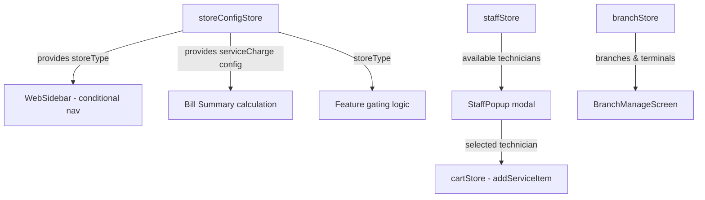

# Design Document: POS Store Types

## Overview

This feature introduces a 3-tier store type system (SERVICE, RETAIL, ENTERPRISE) that controls which features are available in the POS application. Each type unlocks a different feature set:

- **SERVICE** — Staff/technician management, staff selection popup on service products, service charge
- **RETAIL** — Multi-terminal within a single store
- **ENTERPRISE** — Multi-branch with multi-terminal per branch

The design extends the existing Zustand store pattern, adds new type interfaces, and integrates the staff popup into the existing `WebPOSScreen` product-tap flow.

## Architecture



Key architectural decisions:
1. **Single `storeConfigStore`** holds store type + service charge settings — keeps configuration centralized
2. **Cart item extended** with optional `technicianId`/`technicianName` — service items with different technicians become separate line items (no merge)
3. **Product interface extended** with `productType` and per-product `vatRate` already exists; add `productType` field only
4. **Feature gating** uses a pure function `getFeaturesByStoreType(type)` — easy to test

## Components and Interfaces

### New Files

| Path | Purpose |
|------|---------|
| `src/types/store.ts` | StoreType, StoreConfig, Technician, Branch, Terminal interfaces |
| `src/store/storeConfigStore.ts` | Zustand store for store type + service charge |
| `src/store/staffStore.ts` | Zustand store for technician CRUD |
| `src/store/branchStore.ts` | Zustand store for branch + terminal CRUD |
| `src/components/sale/StaffPopup.tsx` | Modal showing available technicians |
| `src/screens/web/WebStaffManageScreen.tsx` | Technician list + CRUD |
| `src/screens/web/WebBranchManageScreen.tsx` | Branch + terminal management |
| `src/data/mockStaff.ts` | Demo technician data |
| `src/data/mockBranches.ts` | Demo branch + terminal data |
| `src/utils/storeFeatures.ts` | `getFeaturesByStoreType()` pure function |
| `src/utils/serviceCharge.ts` | `calcServiceCharge()` pure function |
| `src/utils/vatCalc.ts` | `calcItemVat()` and `calcCartVat()` pure functions |

### Modified Files

| Path | Change |
|------|--------|
| `src/types/product.ts` | Add `productType: 'general' \| 'service'` to `ProductMaster` |
| `src/types/sale.ts` | Add `technicianId?: string`, `technicianName?: string` to `CartItem` |
| `src/store/cartStore.ts` | New `addServiceItem(product, technicianId, technicianName)` — always creates new line item |
| `src/components/web/WebSidebar.tsx` | Conditional nav items based on store type |
| `src/screens/web/WebPOSScreen.tsx` | On product tap: check `productType`, show `StaffPopup` if service |
| `src/data/mockProducts.ts` | Add `productType` field to existing products (default `'general'`) |

## Data Models

```typescript
// src/types/store.ts

export type StoreType = 'SERVICE' | 'RETAIL' | 'ENTERPRISE';

export interface ServiceChargeConfig {
  enabled: boolean;
  mode: 'percentage' | 'fixed';
  value: number; // 0-100 for percentage, positive number for fixed (THB)
}

export interface StoreConfig {
  storeType: StoreType;
  storeName: string;
  serviceCharge: ServiceChargeConfig;
}

export interface Technician {
  id: string;
  name: string;
  position: string; // e.g. "ช่างตัดผม", "ช่างทำเล็บ"
  status: 'available' | 'unavailable';
  photo?: string;
}

export interface Branch {
  id: string;
  name: string;
  address: string;
  contactPhone?: string;
  contactEmail?: string;
}

export interface Terminal {
  id: string;
  branchId?: string; // undefined for RETAIL (single-store)
  name: string;
  status: 'active' | 'inactive';
}
```

### Extended Product Interface

```typescript
// Addition to ProductMaster in src/types/product.ts
export interface ProductMaster {
  // ... existing fields ...
  productType: 'general' | 'service'; // NEW — default 'general'
}
```

### Extended CartItem

```typescript
// Addition to CartItem in src/types/sale.ts
export interface CartItem {
  // ... existing fields ...
  technicianId?: string;   // NEW — populated for service products
  technicianName?: string; // NEW — display name in cart
}
```

## Correctness Properties

*A property is a characteristic or behavior that should hold true across all valid executions of a system — essentially, a formal statement about what the system should do. Properties serve as the bridge between human-readable specifications and machine-verifiable correctness guarantees.*

These properties are designed for property-based testing using **fast-check**. Each property will run a minimum of 100 iterations with randomly generated inputs to ensure correctness across the input space.

### Property 1: Store type determines feature set

*For any* store type value (SERVICE, RETAIL, ENTERPRISE), the function `getFeaturesByStoreType(type)` SHALL return a feature set where: SERVICE includes `staffManagement` and `staffPopup`, RETAIL includes `terminalManagement`, and ENTERPRISE includes `branchManagement` and `terminalManagement`.

**Validates: Requirements 2.2**

### Property 2: Bounded percentage validation

*For any* numeric value, the percentage validation function SHALL accept it if and only if it is a number between 0 and 100 (inclusive). This applies to both service charge percentage and custom VAT percentage inputs.

**Validates: Requirements 3.2, 7.3**

### Property 3: Service charge percentage calculation

*For any* subtotal ≥ 0 and any percentage between 0 and 100, `calcServiceCharge({ mode: 'percentage', value: pct }, subtotal)` SHALL return `subtotal * (pct / 100)`.

**Validates: Requirements 4.2**

### Property 4: Service charge fixed amount calculation

*For any* subtotal ≥ 0 and any positive fixed amount, `calcServiceCharge({ mode: 'fixed', value: amt }, subtotal)` SHALL return `amt`.

**Validates: Requirements 4.3**

### Property 5: Per-item VAT calculation

*For any* cart containing items with individual VAT rates, the total VAT SHALL equal the sum of `(item.subtotal * item.vatRate / 100)` for each item.

**Validates: Requirements 7.4**

### Property 6: Service product cart line items carry technician identity

*For any* service product added N times with N distinct technicians, the cart SHALL contain N separate line items, each with the corresponding technician name. Items with the same product but different technicians SHALL NOT merge.

**Validates: Requirements 5.2, 5.4**

### Property 7: Staff popup filters to available technicians only

*For any* list of technicians with mixed statuses, the staff popup selection list SHALL contain only technicians whose status is "available". The count of displayed technicians SHALL equal the count of technicians with status "available" in the source data.

**Validates: Requirements 8.5, 8.6**

### Property 8: Terminal ID uniqueness

*For any* sequence of terminal creations (within a single store for RETAIL, or within a branch for ENTERPRISE), all assigned terminal IDs SHALL be distinct.

**Validates: Requirements 9.4, 10.6**

### Property 9: Terminal filtering by branch

*For any* set of terminals across multiple branches, selecting a branch SHALL return only terminals whose `branchId` matches the selected branch ID.

**Validates: Requirements 10.4**

## Error Handling

| Scenario | Handling |
|----------|----------|
| Invalid service charge value (negative, > 100 for %) | Validation rejects, shows inline error, doesn't save |
| Invalid custom VAT (negative, > 100) | Same as above |
| No available technicians when service product tapped | Show popup with empty state message, disable confirm button |
| Deleting technician assigned to cart items | Allow delete; existing cart items retain the name as string (no FK constraint) |
| Changing store type with existing branch/terminal data | Warn user; data is preserved but hidden from navigation until type is switched back |

## Testing Strategy

### Property-Based Tests (fast-check)

Each correctness property above maps to a property-based test with minimum 100 iterations. Tests target the pure utility functions to keep execution fast and deterministic.

Library: **fast-check** (`npm install --save-dev fast-check`)

Tag format: `// Feature: pos-store-types, Property N: <description>`

| Test File | Properties | Functions Under Test |
|-----------|-----------|---------------------|
| `src/utils/__tests__/storeFeatures.test.ts` | Property 1 | `getFeaturesByStoreType()` |
| `src/utils/__tests__/validation.test.ts` | Property 2 | `validatePercentage()` |
| `src/utils/__tests__/serviceCharge.test.ts` | Properties 3, 4 | `calcServiceCharge()` |
| `src/utils/__tests__/vatCalc.test.ts` | Property 5 | `calcCartVat()` |
| `src/store/__tests__/cartStore.test.ts` | Property 6 | `addServiceItem()` logic |
| `src/store/__tests__/staffStore.test.ts` | Property 7 | `getAvailableTechnicians()` |
| `src/store/__tests__/branchStore.test.ts` | Properties 8, 9 | `createTerminal()`, `getTerminalsByBranch()` |

Each test MUST:
- Run minimum 100 iterations (`fc.assert(fc.property(...), { numRuns: 100 })`)
- Include a comment tag: `// Feature: pos-store-types, Property N: <title>`
- Use a SINGLE property-based test per correctness property

### Unit Tests (example-based)

Complement property tests with specific examples and edge cases:

- Registration screen renders 3 store type options (Req 1.1, 1.3)
- Default product type is 'general' (Req 6.2)
- General product tap adds to cart without popup (Req 5.5)
- Service charge line item appears/hides based on enabled flag (Req 4.1, 4.4)
- Staff_Manager accessible only for SERVICE type (Req 8.1)
- Branch_Manager accessible only for ENTERPRISE type (Req 10.1)
- Cannot delete last active terminal in RETAIL (Req 9.1)
- Registration blocked when no store type selected (Req 1.4)

### Smoke Tests (demo data)

Verify static mock data correctness:

- SERVICE demo has 3 technicians, 5 service products, 1 general product (Req 11)
- RETAIL demo has 2 terminals (Req 12)
- ENTERPRISE demo has 3 branches × 2 terminals = 6 total (Req 13)
