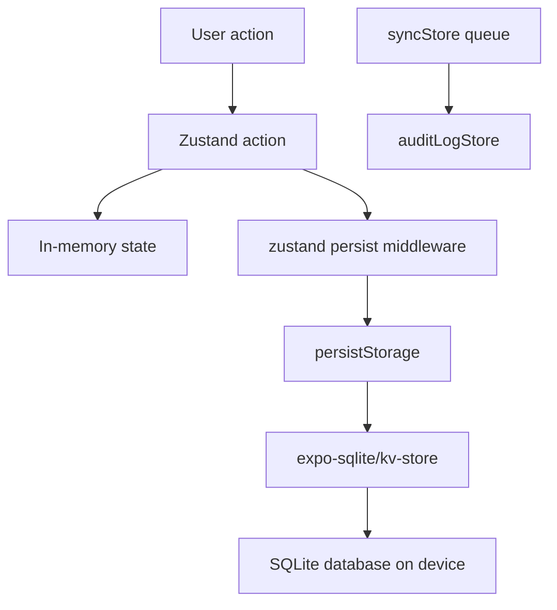
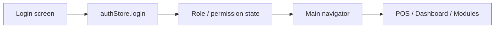
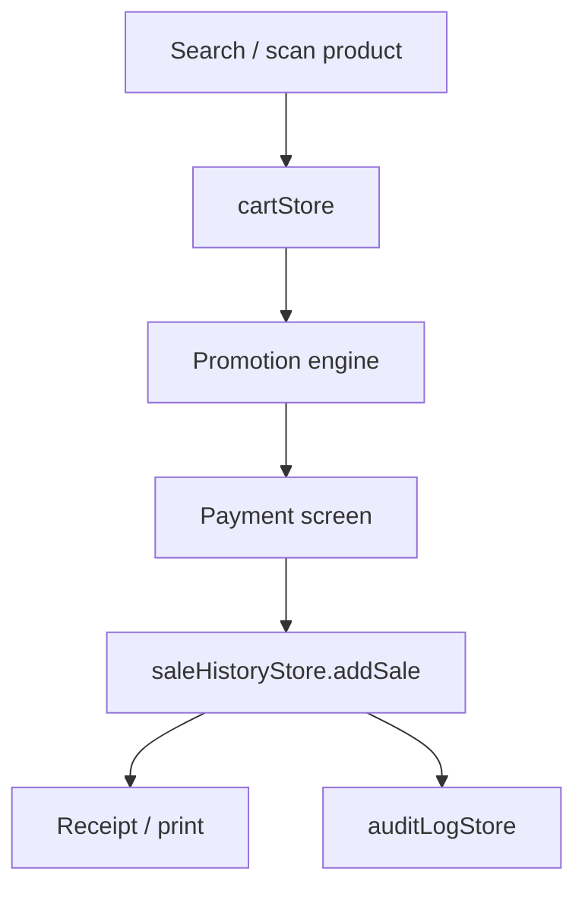
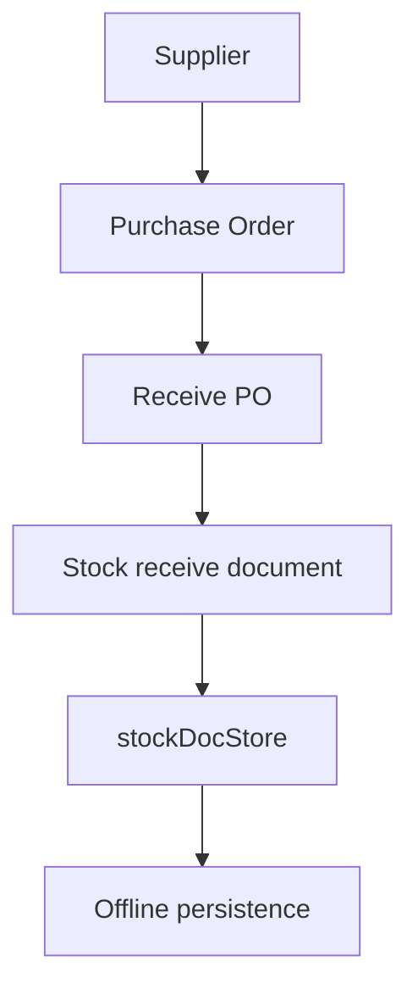
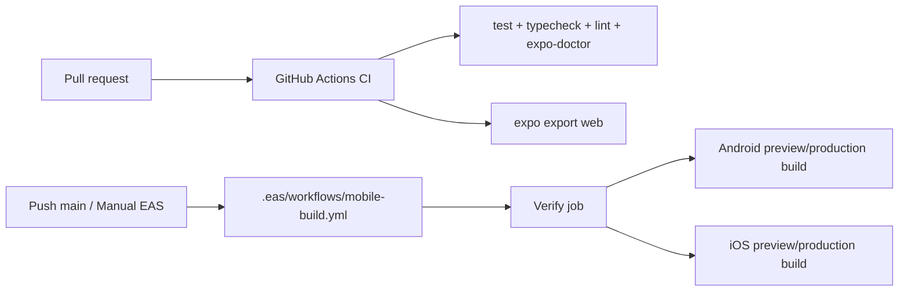

# Xcellence POS System Flow

เอกสารนี้สรุป flow ระบบปัจจุบันสำหรับการใช้งานและการพัฒนาต่อ โดยยึดโครงสร้าง Expo SDK 57, Expo Router, NativeWind v4, Tailwind CSS v3 และ Feature-Driven Clean Architecture

## 1. Runtime Overview

```mermaid
flowchart LR
  User["User / Cashier / Manager"] --> App["Expo App"]
  App --> Router["Expo Router entry"]
  Router --> AppEntry["src/app/index.tsx (platform router)"]
  AppEntry --> Navigation["Navigation modules"]
  Navigation --> Screens["Feature presentation screens"]
  Screens --> Stores["Feature application stores"]
  Stores --> Persist["persistStorage"]
  Persist --> SQLite["expo-sqlite/kv-store"]
  SQLite --> Database["SQLite: Web / iOS / Android"]
```



## 2. Core Modules

| Module | Entry points | Store | Purpose |
| --- | --- | --- | --- |
| Auth | `src/features/auth/presentation/*` | `authStore`, `storeConfigStore` | Login, register, role bootstrap |
| POS Sale | `src/features/sale/presentation/*`, `src/features/web/presentation/screens/POSScreen.tsx` | `cartStore`, `saleHistoryStore`, `shiftStore` | Cart, payment, receipt, sale history |
| Product | `src/features/product/presentation/*`, `src/features/web/presentation/screens/ProductScreen.tsx` | `productStore` | Product master, UOM, import/export |
| Inventory | `src/features/inventory/presentation/*`, `src/features/web/presentation/screens/InventoryScreen.tsx` | `stockDocStore` | Receive, issue, stock document flow |
| Purchase | `src/features/purchase/presentation/*`, `src/features/web/presentation/screens/PurchaseScreen.tsx` | `purchaseStore` | Supplier, PR, PO, receiving |
| CRM | `src/features/member/presentation/*`, `src/features/web/presentation/screens/CRMScreen.tsx` | `memberStore`, `walletStore`, `communicationStore` | Members, points, wallet, campaigns |
| Promotion | `src/features/promotion/presentation/*`, `src/core/pos-engine/*` | `promoStore`, `promoManagementStore` | Promotion rules, validation, benefit engine |
| Reports | `src/features/reports/presentation/*`, `src/features/web/presentation/screens/ReportsScreen.tsx` | report data/mocks | Sales, inventory, profit, enterprise reports |
| Sync | `src/features/sync/presentation/*` | `syncStore`, `auditLogStore` | Local transaction tracking, conflict resolution |

## 3. Offline-first Data Flow

ระบบมี offline persistence อยู่แล้วผ่าน `src/shared/infrastructure/storage/persistStorage.ts`



ข้อควรรู้:

- ข้อมูลสำคัญ persist ลง SQLite แล้ว เช่น products, cart, auth, sale history, stock docs, purchase, members, promotions และ permissions
- Zustand เก็บ working state ใน memory แล้ว serialize แต่ละ store เป็น JSON value ใน SQLite key-value table
- Web, iOS และ Android ใช้ adapter เดียวกัน จึงไม่มี localStorage หรือ AsyncStorage เป็นฐานข้อมูลหลัก
- `syncStore` เก็บ queue และ conflict state แบบ offline ได้ แต่การ sync ปัจจุบันยังเป็น simulation และยังไม่มี server transport จริง
- ก่อนต่อ backend production ให้เพิ่ม repository/service layer, idempotency key และ conflict policy กลาง

## 4. Auth Flow



Demo accounts:

- `admin / 1234`
- `manager / 1234`
- `cashier / 1234`

## 5. POS Sale Flow



## 6. Inventory / Purchase Flow



## 7. Build / CI / CD Flow



## 8. Styling Standard

Target direction:

- Use Tailwind default palettes: `slate`, `gray`, `rose`, `emerald`, `amber`, `sky`
- Main theme is Tailwind `rose`, with `rose-500` as the primary action color
- Do not add app-specific color tokens in `tailwind.config.js`
- Do not use arbitrary hex color utilities; use Tailwind palette classes
- Keep screens dense, scannable, POS-like, and responsive

Current migration state:

- Custom `brand-*` and `pos-*` color utilities have been removed from application UI
- Arbitrary hex color utilities have been migrated to Tailwind default palette classes
- Icon/chart APIs may still receive literal color values when the library does not accept `className`; these values match Tailwind palette colors

## 9. Recommended Project Structure

Current code is screen-heavy. For future cleanup, migrate gradually into this structure:

```text
src/
  app/                    Expo Router routes only
  features/
    auth/
      screens/
      components/
      store/
      types/
    pos/
    inventory/
    purchase/
    crm/
    reports/
  shared/
    components/
    icons/
    storage/
    utils/
  engine/
  data/
  store/                  legacy stores during migration
```

Rule: do not move all files at once. Move one feature at a time, update imports, run `npm run verify`, then continue.
